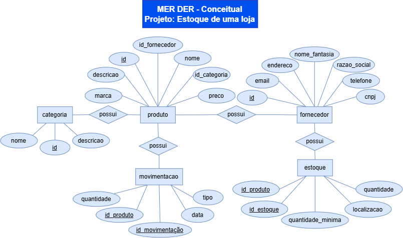
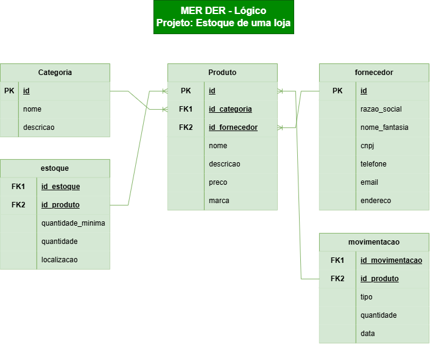

# VPF 01 -  Banco de Dados
## Desafio: Tema02 - Estoque de uma Loja
Um banco de dados de gestão de estoque de uma loja de roupas, é importante controlar produtos, categorias, fornecedores, entradas e saídas de mercadorias.

### Principais entidades e atributos

|Entidade|Atributos básicos|Descrição|
|--------|-----------------|---------|
|Produto| id, nome, descricao, preco, marca, id_categoria, id_fornecedor| representa cada peça de roupa comercilizada pela loja|
|Categoria|id, nome, descricao|Classifica os produtos, como Camisetas, Calças, Vestidos e Jaquetas.|
|Fornecedor|id, razao_social, nome_fantasia, cnpj, telefone, email, endereco|Empresa responsável pelo fornecimento dos produtos.|
|Estoque|id_estoque, id_produto, quantidade, quantidade_minima, localizacao|Controla a quantidade disponível de cada produto.|
|Movimentação de Estoque|id_movimentacao, id_produto, tipo(Entrada, Saída), quantidade, data|Registra entradas e saídas de produtos do estoque.|

## MER DER Conceitual



## MER DER Lógico



## Dicionário de Dados

|Entidade|Atributo|Tipo|Tamanho|Descrição|
|--------|--------|----|-------|---------|
|produto|id|inteiro|11|Chave primária, auto incrementável|
|produto|nome|varchar|80|Nome do produto|
|produto|descricao| varchar|200|Descrição sobre o produto|
|produto|preco|decimal|10,2|Preço do produto|
|produto|marca|varchar|20|Marca do produto|
|produto|id_categoria| inteiro|11|Chave Estrangeira identificadora da categoria do produto|
|produto|id_fornecedor| inteiro |11|Chave Estrageira identificadora do fornecedor do produto|
|categoria|id|inteiro|11| Chave Primária, auto incrementável|
|categoria|nome|varchar|80|nome da categoria do produto|
|categoria|descricao|text| |descrição da categoria do produto|
|fornecedor|id|inteiro|11|Chave Primária, auto incrementável|
|fornecedor|razao_social|varchar|50|Razão social da empresa|
|fornecedor|nome_fantasia|varchar|50|Nome fantasia da empresa|
|fornecedor|cnpj|varchar|20| CNPJ do fornecedor|
|fornecedor|telefone|varchar|16|Telefone do fornecedor|
|fornecedor|email|varchar|30|Email do fornecedor|
|fornecedor|endereco|varchar|30|Endereço do fornecedor|
|estoque|id_estoque|inteiro|11|Chave Estrangeira identificadora do estoque|
|estoque|id_produto|inteiro|11|Chave Estrangeira identificadora do produto|
|estoque|quantidade|inteiro|11|Quantidade de produtos em estoque|
|estoque|quantidade_minima|inteiro|11|Quantidade miníma de produtos que o estoque deve conter|
|estoque|localizacao|varchar|50|Localização do estoque|
|movimentacao|id_movimentacao|inteiro|11|Chave Estrageira identificadora da movimentação|
|movimentacao|id_produto|inteiro|11|Chave Estrangeira identificadora do produto|
|movimentacao|tipo|enum('ENTRADA','SAIDA')|---|Tipo de movimentação|
|movimentacao|quantidade|inteiro|11|Quantidade de produtos movimentados|
|movimentacao|data|datetime|---|data da movimentação|

## Dados de teste em CSV

<a href="produtos.CSV">Produto.csv</a>
<a href="categoria.csv">Categoria.csv</a>
<a href="estoque.csv">Estoque.csv</a>
<a href="fornecedor.csv">Fornecedor.csv</a>
<a href="movimentacao.csv">Movimentação.csv</a>

## Script SQL DDL (Desenvolvimento: Criação do Banco de dados)

```sql
drop database if exists estoque;
create database estoque;
use estoque;

create table produto(
    id int primary key auto_increment not null,
    nome varchar(80) not null,
    descricao varchar(200),
    preco decimal(10,2) not null,
    marca varchar(20) not null,
    id_categoria int not null,
    id_fornecedor int not null
);

create table categoria(
    id int primary key auto_increment not null,
    nome varchar(80) not null,
    descricao text
);

create table fornecedor(
    id int primary key auto_increment not null,
    razao_social varchar(50) not null,
    nome_fantasia varchar(50) not null,
    cnpj varchar(20) not null,
    telefone varchar(16) not null,
    email varchar(30) not null,
    endereco varchar(30) not null
);

create table estoque(
    id_estoque int not null,
    id_produto int not null,
    quantidade int(11) not null,
    quantidade_minima int(11) not null,
    localizacao varchar(50) not null
);

create table movimentacao(
    id_movimentacao int not null,
    id_produto int not null,
    tipo enum('ENTRADA', 'SAIDA'),
    quantidade int(11) not null,
    data datetime not null default(curtime())
);

alter table produto add constraint fk_categoria foreign key (id_categoria) references categoria(id);
alter table produto add constraint fk_fornecedor foreign key (id_fornecedor) references fornecedor(id);
alter table estoque add constraint fk_produto foreign key (id_produto) references produto(id);

```

## Script SQL DML(Manipulação: População com dados de teste)

```sql
use estoque;

insert into produto(nome, descricao, preco, marca, id_categoria, id_fornecedor) values
("Mesa de escritório grande", "mesa", 1500.25, "Madeira-Madeira", 11, 11),
("Cadeira macia", "cadeira", 805, "Madeira-mdf", 11, 12),
("Armário grande", "armario", 2200, "Madeira", 11, 13);

insert into categoria(nome, descricao) values
("Residencial", "Produtos para residencias"),
("Indústrial", "Produtos para indústrias"),
("Escritório", "Produtos para escritórios");

insert into fornecedor(razao_social, nome_fantasia, cnpj, telefone, email, endereco) values
("Madeireira.ltda", "Madeira-Madeira", "12.345.678/0001-95", "(21)39246-0800", "madeirada@sqlemail.com", "Rua das madeiras - 100" ),
("Pinheiros.ltda", "Madeira-mdf", "21.456.938/0001-21", "(21)98944-0800", "pinheirada@dmlemail.com", "Morro dos Pinheiros - 90" ),
("Móveis.ltda", "Madeira", "67.424.908/0001-35", "(21)12658-0800", "moveislegais@ddlemail.com", "Rua dos Movéis - 70" );

insert into estoque(id_estoque, id_produto, quantidade, quantidade_minima, localizacao) values
(221, 122, 55, 20, "Xique-Xique-BA"),
(331, 133, 32, 10, "Niteroi-RJ"),
(441, 144, 14, 5, "Amparo-SP");

insert into movimentacao(id_movimentacao, id_produto, tipo, quatidade, data) values
(31, 122, "ENTRADA", 5, null),
(32, 133, "SAIDA", 10, null),
(33, 144, "SAIDA", 8, null);

```

